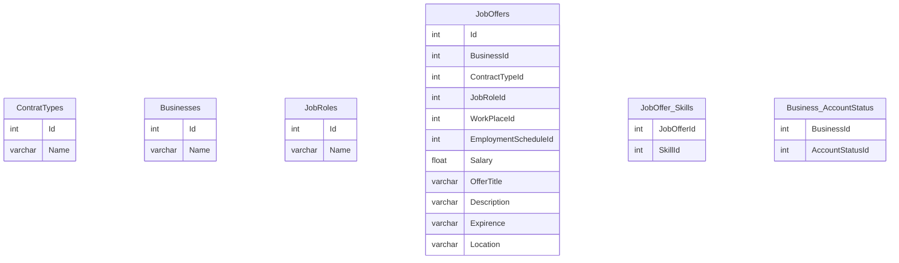
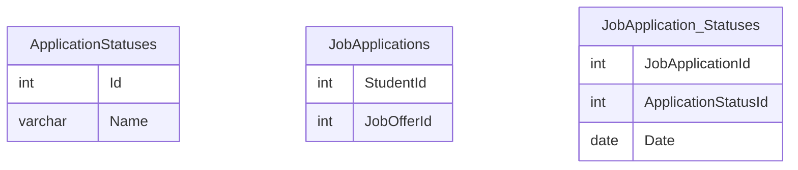

```mermaid
erDiagram
  AcountStatuses {
    int Id
    int Name 
  }
  Genders {
    int Id
    varchar-u Name 
  }
  IdentificationTypes {
    int Id
    varchar-u Name
  }
  StudentTypes {
    int Id
    varchar-u Name
  }
  Carrers {
    int Id
    varchar-u Name
  }
  Semesters {
    int Id
    varchar-u SemesterCode
    varchar year
  }
  Skills {
    int Id
    varchar-u Name
  }
  WorkPlacesTypes {
    int Id
    int-u Name 
  }
  EmploymentSchedules {
    int Id
    int-u Name
  }
  Students {
    int Id
    int-fk StudentTypeId
    int-fk IdentificationTypeId
    varchar Name
    varchar LastName
    varchar GenderId
    varchar IdentificationNumber
    varchar Email
    varchar PhoneNumber
  }
  Students_Carrers {
    int Id
    int StudentId
    int CarrerId 
  }
  Students_Semesters {
    int Id
    int StudentCarrerId
    int SemesterId
  }
  Students_Graduations {
    int Id
    int StudentSemesterId
  }
  Students_Skills {
    int Id
    int StudentId
    int SkillId
  }
  Student_JobPreferences {
    int Id
    int StudentId
    int WorkPlacePreferenceId
    int EmploymentScheduleId
  }
  Student_AccountStatus {
    int-u StudentId
    int AccountStatusId
  }
```

```mermaid
erDiagram
  ContratTypes {
    int Id
    varchar Name
  }
  Businesses {
    int Id
    varchar Name
  }
  JobRoles {
    int Id
    varchar Name
  }
  JobOffers {
    int Id
    int BusinessId
    int ContractTypeId
    int JobRoleId
    int WorkPlaceId
    int EmploymentScheduleId
    float Salary
    varchar OfferTitle
    varchar Description
    varchar Expirence
    varchar Location
  }
  JobOffer_Skills {
    int JobOfferId
    int SkillId
  }
  Business_AccountStatus {
    int BusinessId
    int AccountStatusId
  }
```

```mermaid
erDiagram
  ApplicationStatuses {
    int Id
    varchar Name 
  }
  JobApplications {
    int StudentId
    int JobOfferId
  }
  JobApplication_Statuses {
    int JobApplicationId
    int ApplicationStatusId
    date Date
  }
```