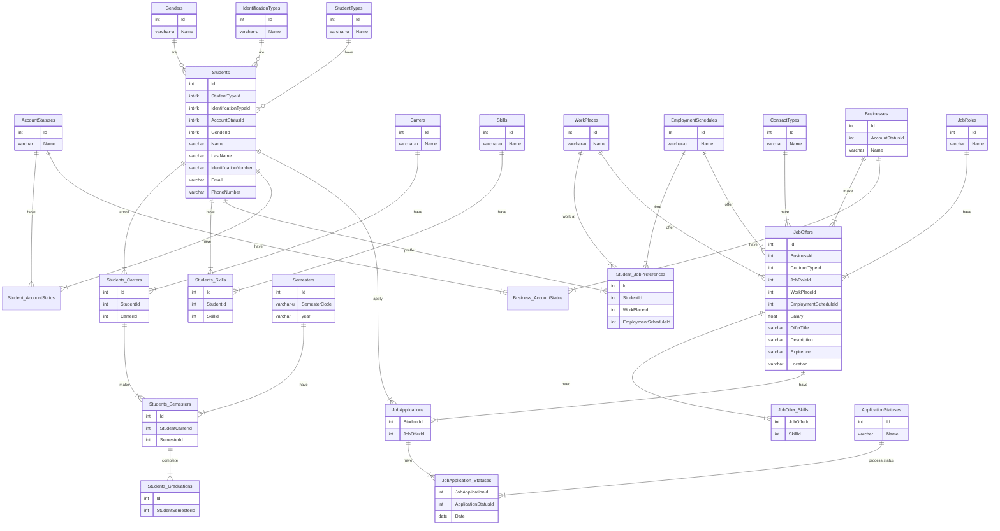

```mermaid
erDiagram
  AccountStatuses ||--|{ Student_AccountStatus: have
  AccountStatuses ||--|{ Business_AccountStatus: have
  AccountStatuses {
    int Id
    varchar Name 
  }
  Genders ||--o{ Students: are
  Genders {
    int Id
    varchar-u Name 
  }
  IdentificationTypes ||--o{ Students: are
  IdentificationTypes {
    int Id
    varchar-u Name
  }
  StudentTypes ||--o{ Students: have
  StudentTypes {
    int Id
    varchar-u Name
  }
  Carrers ||--|{ Students_Carrers: have
  Carrers {
    int Id
    varchar-u Name
  }
  Semesters ||--|{ Students_Semesters: have
  Semesters {
    int Id
    varchar-u SemesterCode
    varchar year
  }
  Skills ||--|{ Students_Skills: have
  Skills {
    int Id
    varchar-u Name
  }
  WorkPlaces ||--|{ Student_JobPreferences: "work at"
  WorkPlaces ||--|{ JobOffers: offer
  WorkPlaces {
    int Id
    varchar-u Name 
  }
  EmploymentSchedules ||--|{ Student_JobPreferences: time
  EmploymentSchedules ||--|{ JobOffers: offer
  EmploymentSchedules {
    int Id
    varchar-u Name
  }
  Students ||--|{ Students_Carrers: enroll
  Students ||--|{ Students_Skills: have
  Students ||--|{ Student_JobPreferences: "preffer"
  Students ||--|{ Student_AccountStatus: have
  Students ||--|{ JobApplications: apply
  Students {
    int Id
    int-fk StudentTypeId
    int-fk IdentificationTypeId
    int-fk AccountStatusId
    int-fk GenderId
    varchar Name
    varchar LastName
    varchar IdentificationNumber
    varchar Email
    varchar PhoneNumber
  }
  Students_Carrers ||--|{ Students_Semesters: make
  Students_Carrers {
    int Id
    int StudentId
    int CarrerId 
  }
  Students_Semesters ||--|{ Students_Graduations: complete
  Students_Semesters {
    int Id
    int StudentCarrerId
    int SemesterId
  }
  Students_Graduations {
    int Id
    int StudentSemesterId
  }
  Students_Skills {
    int Id
    int StudentId
    int SkillId
  }
  Student_JobPreferences {
    int Id
    int StudentId
    int WorkPlaceId
    int EmploymentScheduleId
  }


  ContractTypes ||--|{ JobOffers: have
  ContractTypes {
    int Id
    varchar Name
  }
  Businesses ||--|{ JobOffers: make
  Businesses ||--|{ Business_AccountStatus: have
  Businesses {
    int Id
    int AccountStatusId
    varchar Name
  }
  JobRoles ||--|{ JobOffers: have
  JobRoles {
    int Id
    varchar Name
  }
  JobOffers ||--|{ JobOffer_Skills: need
  JobOffers ||--|{ JobApplications: have
  JobOffers {
    int Id
    int BusinessId
    int ContractTypeId
    int JobRoleId
    int WorkPlaceId
    int EmploymentScheduleId
    float Salary
    varchar OfferTitle
    varchar Description
    varchar Expirence
    varchar Location
  }
  JobOffer_Skills {
    int JobOfferId
    int SkillId
  }


  ApplicationStatuses ||--|{ JobApplication_Statuses: "process status"
  ApplicationStatuses {
    int Id
    varchar Name 
  }
  JobApplications ||--|{ JobApplication_Statuses: have
  JobApplications {
    int StudentId
    int JobOfferId
  }
  JobApplication_Statuses {
    int JobApplicationId
    int ApplicationStatusId
    date Date
  }
```